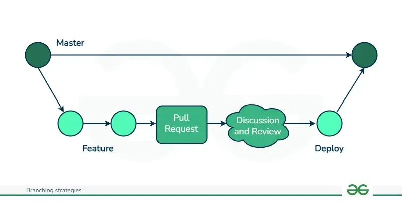

# Git Branching strategies

## 1. **Git Flow**
- **Main Idea:** Structured branching model with dedicated branches for features, releases, and hotfixes.
- **Branching:**
  - `main` (production)
  - `develop` (integration)
  - `feature/*` (new features)
  - `release/*` (preparing a new release)
  - `hotfix/*` (urgent production fixes)
- **Merging:** Features → `develop` → `release` → `main` and `develop`; hotfixes → `main` and `develop`.
- **Best For:** Projects with scheduled releases (e.g., versioned software).
- **Pros:** Clear structure, supports parallel development.
- **Cons:** Overhead for small teams; can slow down CI/CD.

---

## 2. **GitHub Flow**
- **Main Idea:** Simplified workflow with a single `main` branch and short-lived feature branches.
- **Branching:** Feature branches created from `main` and merged back via pull requests.
- **Merging:** Continuous deployment to production after code review.
- **Best For:** Web apps, SaaS, and projects with continuous delivery.
- **Pros:** Simple, encourages frequent deployments.
- **Cons:** Less structure for complex releases; no formal release branches.

---

## 3. **Trunk-Based Development**
- **Main Idea:** All developers work directly on a single branch (usually `main` or `master`).
- **Branching:** Short-lived feature branches (hours/days) are created and merged back quickly.
- **Merging:** Frequent small commits.
- **Best For:** Small teams, CI/CD pipelines, and projects requiring rapid iteration (e.g., startups, agile teams).
- **Pros:** Simplicity, minimal merge conflicts, encourages continuous integration.
- **Cons:** Requires discipline; not ideal for large teams or complex releases.

---

## 4. **GitLab Flow**

---

## **Which One Should You Choose?**
- **Small team, fast iteration?** → Trunk-Based or GitHub Flow.
- **Versioned releases?** → Git Flow.

---
