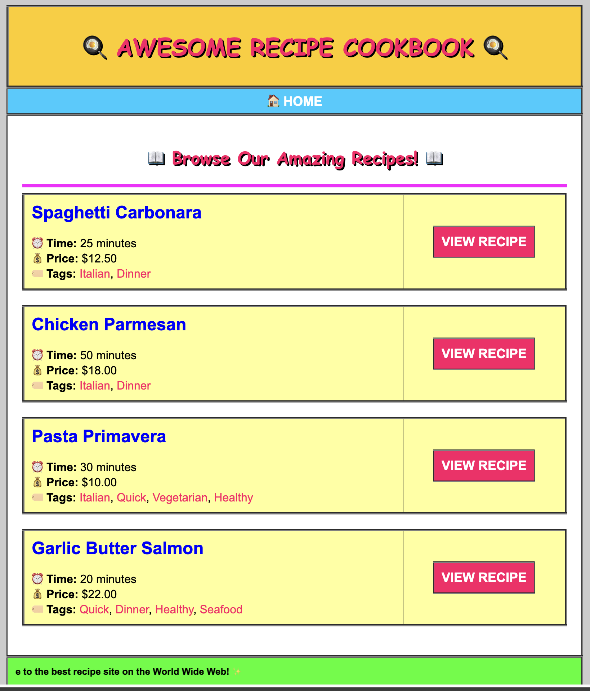

# Deploy from GHCR.io

Create a VM on Azure, and deploy the docker image `awsome-recipe-cookbook`. 

Type: Individual
---

Create a new Virtual Machine on Azure.     
On GitHub Container Registry (ghcr.io) you can find a version of the [Awsome Recipe Cookbook](https://github.com/cookbookio/awsome_recipe_cookbook/pkgs/container/awsome-recipe-cookbook).    

You should deploy this manually by executing the nessesary docker commands. 

Afterwards you should be able to see this in you browser.

