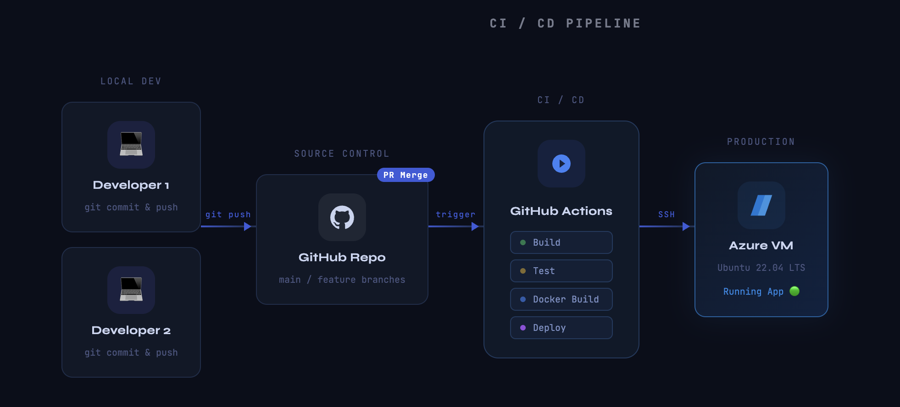

# Continuous Delivery - Continuous Deployment 
Todays focus will be on setting up the Ci/CD pipeline for your CookBook applications.

The main thing we are missing in this context is to create instructions for GitHub Actions. 

After today, when this setup is ready, we can start focusing on code quality, using tests and linting and code reviews. 

## Learning Goals
* Explain what Continuous Delivery (CD) is.
* Be able to write and understand a workflow file.

## Before Class
Prepare for a short informal demo of your projects deployment setup.
* [Manually Deploy you app](../07._Azure_vm_portal_az/exercises/deploy.md)

Have a look at these video
* [What is Continuous Delivery?](https://www.youtube.com/watch?v=2TTU5BB-k9U)
* [Continuous Deployment vs. Continuous Delivery](https://www.youtube.com/watch?v=LNLKZ4Rvk8w)
## Todays Teachings

### Show your work
All groups show their work so far.

* [DenDanskeMetode](https://github.com/DenDanskeMetode/legacyProject) 
* [TheRizzlers](https://github.com/TheRizzlersOrg4Semester/Rizzlerpies) 
* [LNS](https://github.com/Linus-nisse-segmentering/Agile-Linus) 
* [Ostemadprissse](https://github.com/ostemadprinsesse/Dinner-served-and-ate) 
* [BalladeBaderne](https://github.com/Balladebaderne/cookbook) 

---
* [Awsome Recipe Cookbook - CD Branch](https://github.com/cookbookio/awsome_recipe_cookbook/tree/cd)
* [GHCR.io cheatsheet](cheatseet_ghcr.io.md)

## After Class

* [Investigate your favorite repo](exercises/favorite_repo.md)
* [Create your workflow](create_your_workflow.md)
