# Learning Goals: IT Architecture - Agile Development Course

Based on comprehensive analysis of the **Kea IT-Arkitektur - Agil Udvikling 2024 Spring** course repository.

---

## **1. Version Control & Collaboration (Git & GitHub)**

### **Foundational Skills:**
- Use Git for version control (clone, commit, push, pull)
- Navigate Git history and understand commit SHAs
- Configure `.gitignore` files for proper file management
- Understand what files should never be committed (secrets, OS files, IDE configs)

### **Advanced Collaboration:**
- Create and manage Git branches effectively
- Resolve merge conflicts manually
- Use Git stash for temporary work storage
- Apply different branching strategies (Feature Branching, Gitflow, Trunk-based Development)
- Create and review Pull Requests professionally
- Understand merge vs. rebase workflows
- Use squash commits for cleaner history
- Create annotated tags and GitHub Releases with semantic versioning
- Implement Git hooks for quality enforcement

## **2. DevOps Culture & Philosophy**

### **Conceptual Understanding:**
- Explain the historical evolution from Waterfall to Agile to DevOps
- Understand the Dev vs. Ops paradigm and how DevOps bridges them
- Apply the DevOps 8 framework principles
- Differentiate between Continuous Integration, Continuous Delivery, and Continuous Deployment
- Critically analyze Agile methodology adoption challenges in organizations
- Understand the business value of DevOps practices

### **Cultural Competencies:**
- Embrace automation and "infrastructure as code" mindset
- Practice "making work visible" through status badges and monitoring
- Apply continuous improvement principles
- Understand organizational challenges (culture clash, silos) in DevOps adoption

## **3. Terminal & Command Line Proficiency**

### **Basic Operations:**
- Navigate file systems using `pwd`, `cd`, `ls`
- Create, move, copy, and delete files/directories
- Read file contents with `cat` and text editors
- Understand differences between *nix and Windows terminals

### **Text Editors:**
- Use Nano for simple editing tasks
- Understand Vim modes (Normal, Insert, Visual, Command)
- Perform basic text manipulation in terminal environments

### **Advanced Tools:**
- Use `jq` for JSON processing
- Use GitHub CLI (`gh`) for repository management
- Apply cross-platform file naming best practices

## **4. Configuration & Data Formats**

### **YAML:**
- Write syntactically correct YAML files
- Understand indentation and data structure rules
- Create configuration files for CI/CD workflows

### **Markdown:**
- Format documentation with headers, lists, emphasis
- Insert links, images, and code blocks
- Create professional README files and documentation

### **JSON:**
- Understand JSON structure
- Process JSON data programmatically

## **5. CI/CD Pipeline Development**

### **GitHub Actions:**
- Understand workflows, jobs, steps, and runners
- Create automated workflows triggered by events
- Use GitHub Actions Marketplace
- Access GitHub context and metadata
- Use secrets (GITHUB_TOKEN) securely
- Implement matrix builds for multi-version testing
- Configure workflow permissions properly

### **Continuous Integration:**
- Set up automated testing for Node.js applications
- Use `npm ci` for reproducible builds
- Implement linting with ESLint/Standard.js
- Use Super Linter for multi-language projects
- Create status badges for repository visibility

### **Quality Gates:**
- Configure branch protection rules
- Require status checks before merging
- Mandate code reviews
- Use pull request templates

## **6. Build Tools & Package Management**

### **Cross-Platform Package Managers:**
- Use Chocolatey (Windows), Homebrew (macOS), apt (Linux)
- Understand OS-level vs. language-specific package managers

### **Language-Specific Tools:**
- Work with npm and `package.json`
- Understand pip, cargo, go mod, maven/gradle equivalents
- Use PM2 for production Node.js process management

## **7. Cloud Computing (Microsoft Azure Focus)**

### **Cloud Fundamentals:**
- Differentiate between SaaS, PaaS, IaaS, FaaS, DaaS, STaaS
- Understand public, private, and hybrid cloud deployments
- Navigate Azure regions and data centers
- Manage Azure resource groups
- Monitor and optimize cloud costs

### **Virtual Machines:**
- Create and configure Ubuntu VMs on Azure
- Generate and use SSH keys (RSA 4096-bit) securely
- Configure network security (inbound/outbound port rules)
- Assign static IP addresses
- Install runtime environments (Node.js via nvm, MySQL)

### **Networking:**
- Understand Virtual Networks (VPC/VNET)
- Configure private and public subnets
- Use Network Access Control Lists (NACL) and Security Groups
- Work with Internet Gateways, NAT, VPC Peering
- Understand Load Balancers (NLB, ALB)

### **Azure Storage:**
- Work with Azure Blob Storage and containers
- Manage access control (Anonymous, Azure AD, SAS tokens)
- Generate and use Shared Access Signatures (SAS)
- Compare with AWS S3

### **Serverless Computing:**
- Create Azure Functions
- Understand triggers and bindings
- Compare serverless subscription models (Consumption, Premium, App Service)
- Handle cold start performance considerations
- Develop and test Azure Functions locally

### **Azure Services:**
- Use Azure Key Vault for secrets management
- Work with Azure Service Bus (Queues and Topics)
- Use Azure SQL Database
- Understand Azure CDN, VPN Gateways, API Gateways
- Use Azure CLI (`az`) for infrastructure management

## **8. Software Architecture Patterns**

### **Architectural Decisions:**
- Compare monolithic vs. microservices architectures
- Evaluate monorepo vs. polyrepo strategies
- Understand internal communication patterns in distributed systems
- Make informed architecture choices based on project needs

## **9. Professional Development Practices**

### **Code Quality:**
- Implement and enforce linting standards
- Use pre-commit hooks for quality checks
- Write meaningful commit messages
- Perform thorough code reviews
- Create comprehensive issue and PR templates

### **Project Management:**
- Use GitHub Projects with Kanban boards
- Track issues effectively
- Organize work into manageable tasks
- Document decisions and progress

### **Security:**
- Never commit secrets or sensitive data
- Use environment variables and secrets management
- Generate and manage SSH keys properly
- Apply least-privilege access principles
- Use SAS tokens with appropriate permissions and expiration

## **10. Automation & Infrastructure**

### **Infrastructure as Code (IaC):**
- Understand different infrastructure management approaches (Console UI, CLI/API, SDK/CDK, IaC)
- Use Vagrant for local VM provisioning
- Automate infrastructure setup and teardown

### **Deployment Automation:**
- Deploy applications to cloud VMs
- Automate release processes
- Create automated release notes
- Implement continuous deployment pipelines

## **11. Problem-Solving & Debugging**

### **Technical Skills:**
- Troubleshoot merge conflicts
- Debug CI/CD pipeline failures
- Diagnose cloud deployment issues
- Navigate complex technical documentation
- Research and evaluate technical solutions independently

### **Growth Mindset:**
- Progress from following single solutions to exploring multiple approaches
- Handle increasing complexity throughout the semester
- Build resilience in debugging difficult problems
- Learn to fail fast and iterate

## **12. Team Collaboration**

### **Communication:**
- Use version control for team coordination
- Write clear PR descriptions and commit messages
- Provide constructive code review feedback
- Document decisions for team visibility

### **Workflow Practices:**
- Follow established branching strategies
- Respect code review processes
- Use issue tracking for accountability
- Collaborate through GitHub Projects

---

## **Meta-Learning Goals**

Beyond technical skills, students would develop:

- **Self-directed learning**: Progress from guided exercises to independent problem-solving
- **Tool proficiency**: Comfort with professional developer toolchain
- **Industry readiness**: Exposure to real-world DevOps practices used in software companies
- **Cross-platform awareness**: Understanding of Windows, macOS, and Linux environments
- **Cost consciousness**: Awareness of cloud resource costs and optimization
- **Documentation skills**: Ability to create and maintain professional technical documentation
- **Critical thinking**: Evaluating trade-offs between different technical approaches
- **Integration thinking**: Understanding how DevOps supports broader IT architecture goals

---

## **Course Overview**

### **Course Details**
- **Course Name:** Agil Udvikling (Agile Development)
- **Institution:** KEA (Copenhagen School of Design and Technology)
- **Program:** IT-Arkitektur (IT Architecture)
- **Semester:** Spring 2024
- **Duration:** 6 weeks (January 30th - March 19th, 2024)

### **Module Structure**

**Module 1: Introduction (Week 1)**
- Git and GitHub fundamentals
- DevOps Introduction
- CI/CD/CD Fundamentals
- YAML and Terminal Commands

**Module 2: Agile (Week 2)**
- Agile Methodology
- DevOps Deep Dive
- Markdown
- Build Tools and Package Managers

**Module 3: GitHub Actions (Week 3)**
- Git Branching
- GitHub Actions Fundamentals
- CI/CD Platforms Comparison
- Workflow Creation

**Module 4: Continuous Integration (Week 4)**
- Git Tagging and Releases
- Branching Strategies
- Monorepos
- Linting and Quality Control

**Module 5: Cloud (Week 5)**
- Cloud Providers and Models
- Azure Fundamentals
- Virtual Machines and Networking
- Serverless Computing

### **Course Philosophy**

The course follows a deliberate progression model:

| Aspect | Beginning | End of Semester |
|--------|-----------|-----------------|
| Reading | First two weeks only | None |
| Workload | High | None (focus on exam project) |
| Knowledge Acquisition | Many new things | Cementing knowledge |
| Topic Complexity | Shallow | Complex |
| Solution Space | One way | Large number of solutions |
| Ease of Debugging | Easy | Very hard |

**Key Course Values:**
- Hands-on learning over theory
- Early problem detection (fail fast)
- Creating value for users
- Infrastructure automation
- Reproducibility
- Security consciousness
- Professional best practices

---

This course provides a comprehensive foundation in modern DevOps practices, preparing students for professional software development environments where automation, collaboration, and cloud infrastructure are essential daily skills.

---

## **Learning Goals Mind Maps**

### **1. Version Control & Git Mind Map**

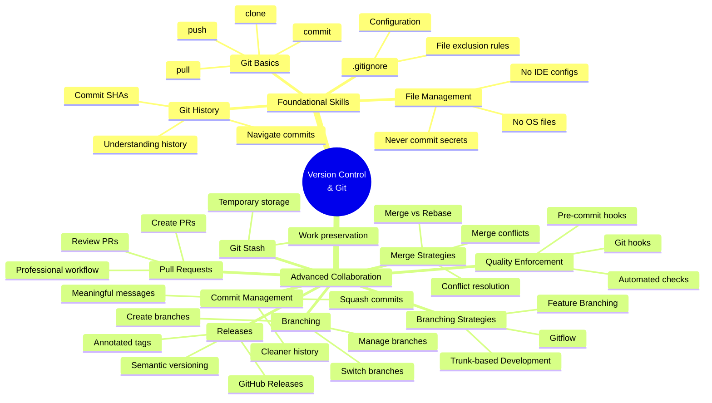

### **2. DevOps Culture & Philosophy Mind Map**

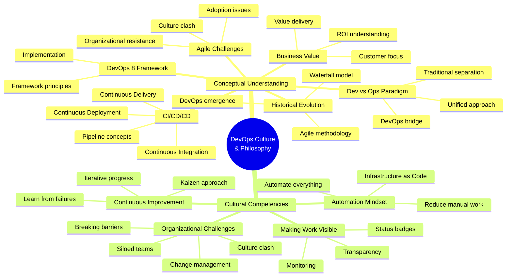

### **3. Terminal & Command Line Proficiency Mind Map**

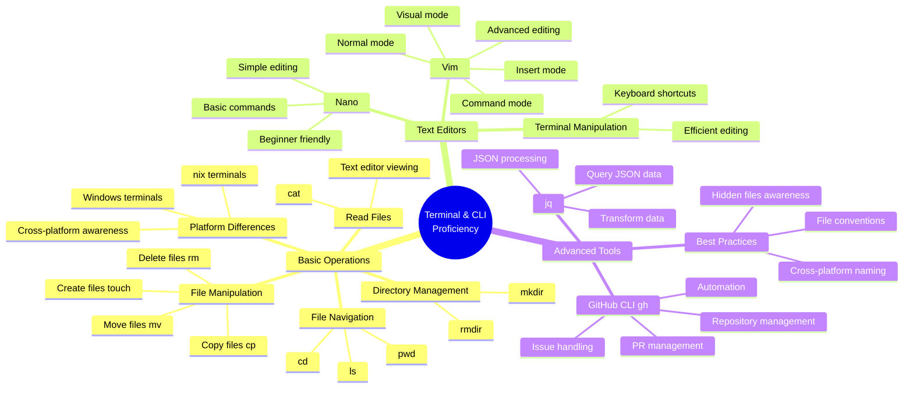

### **4. Configuration & Data Formats Mind Map**

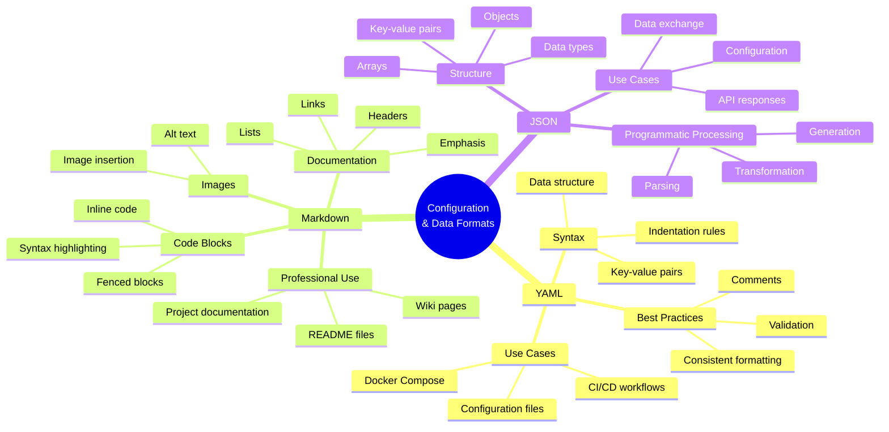

### **5. CI/CD Pipeline Development Mind Map**

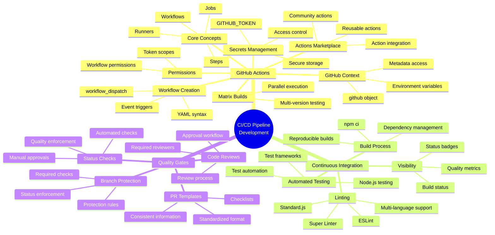

### **6. Build Tools & Package Management Mind Map**

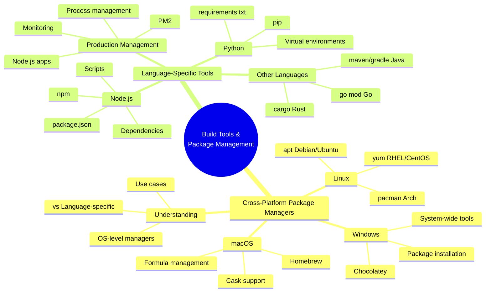

### **7. Cloud Computing (Azure) Mind Map**

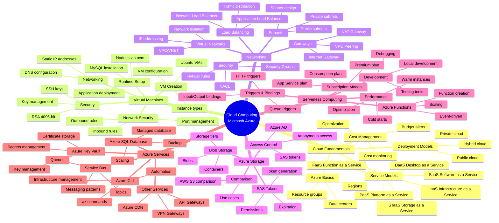

### **8. Software Architecture Patterns Mind Map**

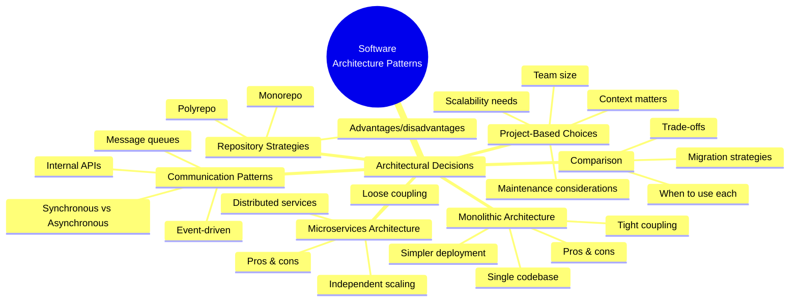

### **9. Professional Development Practices Mind Map**

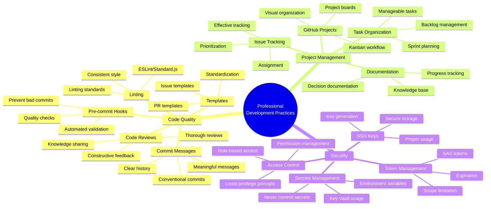

### **10. Automation & Infrastructure Mind Map**

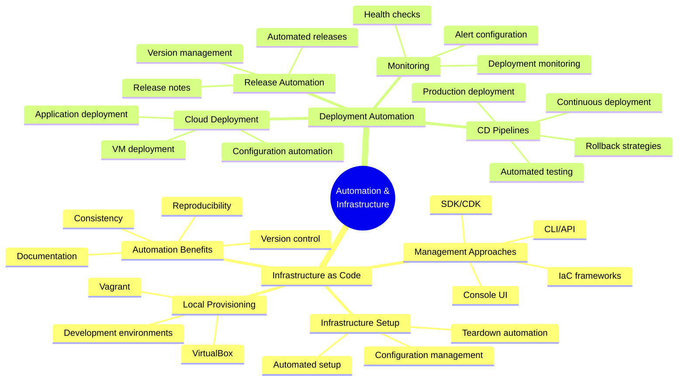

### **11. Problem-Solving & Debugging Mind Map**

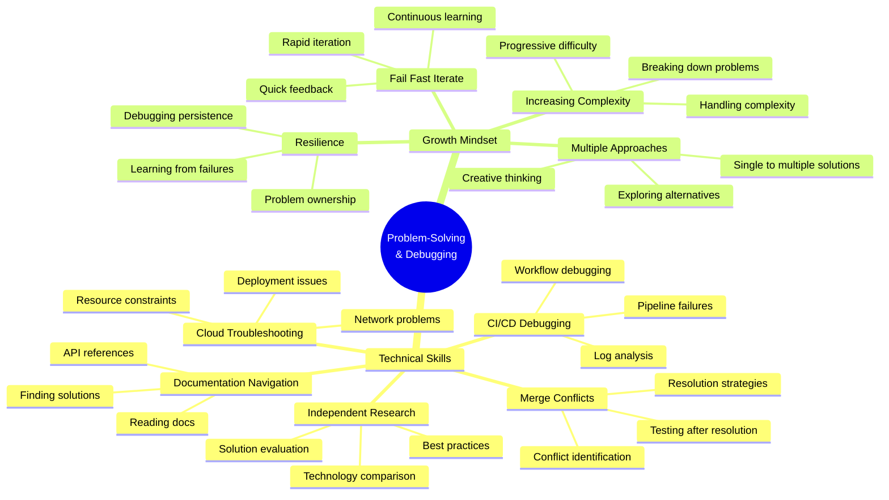

### **12. Team Collaboration Mind Map**

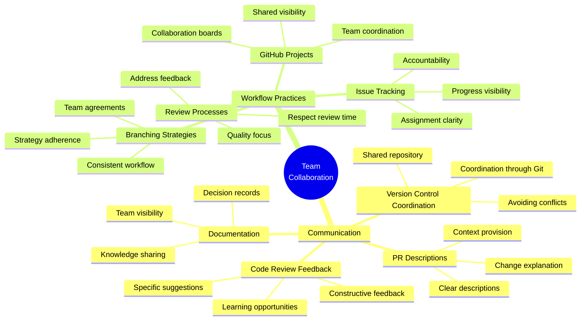

### **13. Meta-Learning Goals Mind Map**

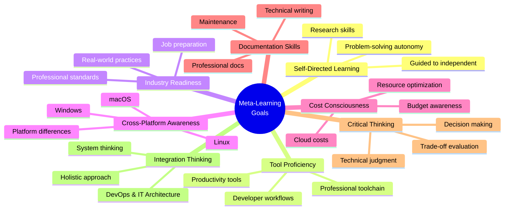
