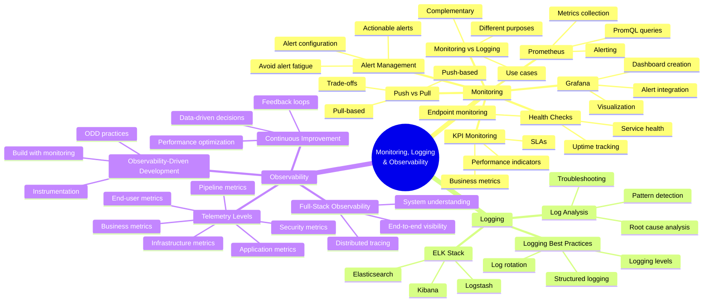

# Learning Goals: DevOps 2025 Autumn Course

Based on comprehensive analysis of the **EK_DAT_DevOps_2025_Autumn** course repository.

---

## **1. Version Control & Collaboration**

### **Git Fundamentals:**
- Use essential Git commands (clone, add, commit, push, pull)
- Navigate Git history and understand version control benefits
- Work with remote repositories on GitHub
- Understand the importance of commit messages and documentation

### **Advanced Git Workflows:**
- Create and manage branches effectively
- Merge branches and resolve merge conflicts
- Implement branching strategies (Git Flow, GitHub Flow, trunk-based development)
- Evaluate and select appropriate branching strategies for projects
- Analyze team collaboration through version control

### **GitHub Collaboration:**
- Create and manage GitHub Issues for task tracking
- Use Pull Request templates for standardized reviews
- Implement branch protection rules
- Practice code review culture
- Use GitHub Projects for Kanban-style project management

## **2. DevOps Culture & Philosophy**

### **Conceptual Understanding:**
- Formulate a personal definition of DevOps
- Understand DevOps as a culture, not just tools
- Explain the historical evolution from traditional IT to DevOps
- Understand the Dev vs. Ops divide and how DevOps bridges it
- Apply the Three Ways of DevOps: Flow, Feedback, Continuous Learning
- Understand the DevOps 8 / Möbius strip concept

### **Cultural Practices:**
- Practice psychological safety in teams
- Implement blameless postmortem culture
- Embrace failure as learning opportunities
- Value transparency and making work visible
- Practice "You build it, you run it" mentality
- Understand that DevOps is not a separate team but embedded practices
- Apply continuous improvement mindset

### **Agile Methodology:**
- Understand agile principles and history
- Apply agile practices in team collaboration
- Practice pair programming
- Implement code review culture

## **3. Linux & Terminal Proficiency**

### **Basic Operations:**
- Navigate file systems using command line
- Manage files and directories
- Understand Linux file permissions
- Use SSH for remote server access
- Perform basic server troubleshooting

### **Network & Process Management:**
- Use `ps` to monitor processes
- Use `lsof` to list open files and network connections
- Use `netstat` for network debugging
- Troubleshoot network connectivity issues
- Manage running applications on servers

## **4. Cloud Computing (Microsoft Azure)**

### **Azure Fundamentals:**
- Understand cloud service models (IaaS, PaaS, SaaS)
- Navigate Azure portal and services
- Understand Azure regions and resource groups
- Manage cloud costs and resources

### **Virtual Machines:**
- Create and configure Azure Virtual Machines
- Manage VM networking and security
- Configure static IP addresses
- Set up port rules and network security groups
- SSH into cloud VMs and manage applications

### **Cloud Deployment:**
- Deploy applications to cloud infrastructure
- Manage production environments in the cloud
- Understand differences between VM and PaaS deployments
- Implement cloud-based deployment strategies

## **5. CI/CD Pipeline Development**

### **Continuous Integration:**
- Understand CI/CD/CD concepts (Integration, Delivery, Deployment)
- Create GitHub Actions workflows
- Configure workflow triggers (push, pull request, schedule, manual)
- Use GitHub Actions runners, jobs, steps, and actions
- Implement automated testing in pipelines
- Use GitHub Secrets for secure credential management

### **Continuous Delivery & Deployment:**
- Implement fully automated deployment pipelines
- Understand push-based vs. pull-based deployment
- Implement GitOps principles
- Configure smoke testing after deployments
- Implement zero-downtime deployments

### **Pipeline Optimization:**
- Optimize pipeline execution time
- Implement caching strategies
- Use matrix builds for multi-environment testing
- Monitor pipeline performance

## **6. Software Quality & Testing**

### **Code Quality:**
- Understand software quality metrics
- Identify and manage technical debt
- Implement static code analysis
- Use linting tools for code consistency
- Integrate quality tools (SonarQube, Code Climate, DeepSource)
- Configure branch protection with quality gates

### **Testing Strategies:**
- Understand shift-left vs. shift-right testing
- Implement continuous testing practices
- Use end-to-end testing tools (Playwright)
- Implement smoke testing
- Understand testing pyramid concepts
- Balance testing effort with business value

## **7. Docker & Containerization**

### **Docker Fundamentals:**
- Understand containers vs. virtualization vs. packaging
- Write efficient Dockerfiles
- Build and manage Docker images
- Run and debug Docker containers
- Implement multi-stage Docker builds
- Use Docker best practices for security and efficiency

### **Docker Compose:**
- Create docker-compose.yml configurations
- Manage multi-container applications
- Implement hot reload/live reload in containers
- Debug containerized applications
- Understand container networking

### **Container Security:**
- Scan Docker images for vulnerabilities
- Use Hadolint for Dockerfile linting
- Implement security best practices in containers
- Understand container image layers and optimization

## **8. Security (DevSecOps)**

### **Security Integration:**
- Understand DevSecOps philosophy (shifting security left)
- Differentiate between SAST and DAST
- Implement security scanning in CI/CD pipelines
- Use automated security tools

### **Infrastructure Security:**
- Configure firewalls and IP tables
- Implement fail2ban for brute-force protection
- Set up SSL/TLS with Certbot
- Manage HTTPS and certificates
- Harden GitHub Actions workflows
- Implement defense-in-depth strategies

### **Application Security:**
- Avoid committing secrets to version control
- Use environment variables for sensitive data
- Implement secure SSH key management
- Understand security vulnerabilities and mitigations

## **9. Databases & Data Management**

### **Database Operations:**
- Evaluate database options beyond MySQL
- Understand ORM vs. raw SQL trade-offs
- Implement database migrations
- Differentiate between seeding and migrations
- Use migration tools (Knex.js, Alembic)
- Implement full-text search (FTS5)

### **Data Collection:**
- Understand web scraping vs. web crawling
- Use scraping tools (Cheerio, BeautifulSoup4, Scrapy)
- Understand ethics and legality of web scraping
- Implement responsible data collection practices

## **10. Monitoring, Logging & Observability**

### **Monitoring:**
- Differentiate between monitoring and logging
- Implement push vs. pull-based monitoring
- Set up Prometheus for metrics collection
- Create Grafana dashboards for visualization
- Monitor KPIs and business metrics
- Prevent alert fatigue
- Implement health checks

### **Logging:**
- Understand logging levels and best practices
- Implement structured logging
- Use ELK stack (Elasticsearch, Logstash, Kibana)
- Analyze logs for troubleshooting

### **Observability:**
- Understand telemetry levels (business, application, infrastructure, end-user, deployment pipeline, security)
- Practice Observability-Driven Development (ODD)
- Use observability to drive continuous improvement
- Implement full-stack observability

## **11. Infrastructure as Code (IaC)**

### **IaC Fundamentals:**
- Understand benefits of IaC (version control, automation, reproducibility, disaster recovery)
- Differentiate between ClickOps, CLI, SDK/CDK, and IaC
- Understand imperative vs. declarative approaches
- Understand idempotency in infrastructure management

### **Terraform:**
- Write Terraform configurations
- Use Terraform providers (Azure, GitHub)
- Manage infrastructure state
- Apply IaC best practices
- Use configuration management tools

## **12. Deployment Strategies & Orchestration**

### **Deployment Patterns:**
- Implement blue-green deployments
- Implement canary deployments
- Understand rolling updates vs. ramped deployments
- Use shadow deployment / dark launching
- Implement feature toggling
- Understand cluster immune system

### **Orchestration:**
- Understand orchestration concepts
- Learn Kubernetes basics (pods, deployments, services)
- Manage containerized applications at scale
- Understand service discovery and load balancing

## **13. API Design & Documentation**

### **OpenAPI Specification:**
- Create OpenAPI specifications
- Document APIs using OpenAPI
- Ensure API compliance with specifications
- Use API documentation tools (Postman)

### **API Best Practices:**
- Design RESTful APIs
- Implement consistent API conventions
- Version APIs appropriately
- Consider API performance and response times

## **14. Architecture & Design Decisions**

### **Architectural Patterns:**
- Understand monolith vs. monorepo vs. multirepo
- Evaluate microservices architectures
- Make informed architectural decisions
- Understand trade-offs of different approaches

### **Code Organization:**
- Apply naming and casing conventions
- Organize code for maintainability
- Manage dependencies effectively
- Create dependency graphs

### **Legacy Code:**
- Perform source code archaeology
- Analyze legacy codebases
- Identify problems in existing code
- Plan incremental modernization vs. rewrites

## **15. Incident Response & Reliability**

### **Incident Management:**
- Implement incident response procedures
- Conduct blameless postmortems
- Document incidents and learnings
- Share knowledge from failures

### **Reliability:**
- Understand Service Level Agreements (SLAs)
- Implement resilience patterns
- Understand chaos engineering principles
- Plan for disaster recovery
- Balance reliability with development speed

## **16. Build Tools & Environment Management**

### **Build Systems:**
- Understand OS-level vs. language-specific build tools
- Use Make and other build systems
- Manage package dependencies
- Optimize build processes

### **Environment Configuration:**
- Use environment variables effectively
- Manage .env files securely
- Configure different environments (dev, staging, production)
- Ensure environment parity

## **17. Web Technologies**

### **Reverse Proxies:**
- Configure Nginx as reverse proxy
- Understand proxy patterns
- Manage SSL termination
- Implement load balancing

### **Search & Indexing:**
- Implement search indexing
- Understand ranking algorithms
- Optimize search performance
- Implement full-text search capabilities

## **18. Professional Development & Team Skills**

### **Project Management:**
- Work effectively in teams
- Track progress using project boards
- Manage technical tasks and priorities
- Communicate technical decisions

### **Documentation:**
- Write clear technical documentation
- Create system diagrams
- Document architectural decisions
- Maintain living documentation

### **Critical Thinking:**
- Justify technology choices
- Evaluate trade-offs
- Reflect on advantages and disadvantages
- Learn from mistakes and iterate

### **Communication:**
- Present technical work effectively
- Write concise technical reports
- Explain complex concepts clearly
- Collaborate across teams

---

## **Meta-Learning Goals**

Beyond technical skills, students would develop:

- **Production Mindset**: Experience running real systems under realistic load conditions through "The Simulation"
- **Problem-Solving Under Pressure**: Handle production incidents and performance issues
- **Self-Directed Learning**: Choose and learn new frameworks and tools independently
- **Critical Evaluation**: Assess tools and practices rather than blindly adopting trends
- **Business Awareness**: Understand KPIs, SLAs, and business value
- **Resilience**: Persist through challenges and learn from failures
- **Continuous Improvement**: Iterate and refine systems over time
- **Holistic Thinking**: See connections between code, infrastructure, operations, and business
- **Automation Mindset**: Identify opportunities for automation and implement them
- **Security Consciousness**: Integrate security thinking into all decisions

---

## **Course Overview**

### **Course Details**
- **Course Name:** DevOps
- **Institution:** KEA (Copenhagen School of Design and Technology)
- **Semester:** Autumn 2025
- **Duration:** 13 weeks (August 28 - December 18, 2025)
- **Format:** Hands-on, project-based learning

### **Unique Course Features**

**The Simulation:**
- Automated system that simulates real-world web traffic
- Tests student projects continuously throughout semester
- Provides realistic production pressure
- Tracks errors and response times
- Enforces OpenAPI compliance
- Increases traffic organically over time

**Legacy Project:**
- Students modernize "¿Who Knows?" search engine from 2009
- Real legacy code provides authentic experience
- Must rewrite in modern framework (not Flask, Express, or Spring Boot)

**Two-Track Learning:**
- Technology track: Concrete technical assignments
- Culture track: DevOps philosophy and reflection

**Assessment Approach:**
- Two mandatory assignments with group work, individual submission
- Final exam: Written report (max 4 pages) + working project + oral presentation
- Emphasis on understanding WHY, not just HOW
- Git commit analysis verifies individual participation

### **Weekly Topics**

| Week | Topic |
|------|-------|
| 1 | Introduction & Legacy Code |
| 2 | Conventions, OpenAPI, Environment Variables |
| 3 | GitHub Actions, Cloud, Azure, Deployment |
| 4 | Software Quality, Linting, CI |
| 5 | Docker & The Simulation |
| 6 | Docker-compose, Continuous Delivery, Agile, DevOps |
| 7 | Guest Lecture (Eficode) |
| 8 | Continuous Deployment |
| 9 | Testing & Security (DevSecOps) |
| 10 | Databases, ORM, Web Scraping |
| 11 | Searching, Logging, Monitoring |
| 12 | Infrastructure as Code (IaC) |
| 13 | Deployment Strategies, Orchestration, Maintenance |
| 14-16 | Project Completion & Exam Preparation |

### **Course Philosophy**

**Core Principles:**
- DevOps is about people and processes, not just technology
- "You build it, you run it" mentality
- Psychological safety enables innovation
- Blameless culture promotes learning
- Automation enables teams to "lean back" later
- Continuous learning and experimentation
- Make work visible through monitoring and documentation

**Learning Progression:**
The course has a steep learning curve at the beginning that eases toward the end, reflecting DevOps principles where early investment in automation pays dividends later.

**Key Values:**
- Embrace failure as learning opportunities
- Focus on business value and KPIs
- Balance speed with quality and security
- Think critically about tools and practices
- Value transparency and communication
- Practice continuous improvement

---

## **Technologies & Tools Stack**

### **Core Technologies**
- **Version Control:** Git, GitHub, GitHub Actions
- **Cloud Platform:** Microsoft Azure (VMs, networking, resource groups)
- **Containerization:** Docker, Docker Compose
- **Orchestration:** Kubernetes (basics)
- **Infrastructure as Code:** Terraform
- **Web Server:** Nginx (reverse proxy)

### **Programming Languages**
Students choose their own, with examples in:
- Python (2 and 3)
- Node.js/JavaScript
- Go, Ruby, Java, C#, Rust

### **Databases**
- SQLite (legacy)
- PostgreSQL
- MySQL
- Migration tools: Knex.js (Node), Alembic (Python)

### **Monitoring & Logging**
- Prometheus (metrics)
- Grafana (dashboards)
- ELK Stack (Elasticsearch, Logstash, Kibana)

### **Security Tools**
- fail2ban
- Certbot (SSL/TLS)
- Docker security scanning
- Hadolint (Dockerfile linting)

### **Quality Tools**
- SonarQube/SonarCloud
- Code Climate
- DeepSource
- CodeRabbit
- Language-specific linters

### **Testing**
- Playwright (end-to-end)
- Framework-specific testing tools
- Smoke testing

### **Web Scraping**
- Cheerio (Node.js)
- BeautifulSoup4 (Python)
- Scrapy (Python framework)

---

This course provides comprehensive DevOps training that combines technical skills with cultural understanding, preparing students for modern software development roles where they will build, deploy, and operate systems in production environments.

---

## **Learning Goals Mind Maps**

### **1. Version Control & Collaboration Mind Map**

### **2. DevOps Culture & Philosophy Mind Map**

### **3. Linux & Terminal Proficiency Mind Map**

### **4. Cloud Computing (Azure) Mind Map**

### **5. CI/CD Pipeline Development Mind Map**

### **6. Software Quality & Testing Mind Map**

### **7. Docker & Containerization Mind Map**

### **8. Security (DevSecOps) Mind Map**

### **9. Databases & Data Management Mind Map**

### **10. Monitoring, Logging & Observability Mind Map**

### **11. Infrastructure as Code Mind Map**

### **12. Deployment Strategies & Orchestration Mind Map**

### **13. API Design & Documentation Mind Map**

### **14. Architecture & Design Decisions Mind Map**

### **15. Incident Response & Reliability Mind Map**

### **16. Build Tools & Environment Management Mind Map**

### **17. Web Technologies Mind Map**

### **18. Professional Development & Team Skills Mind Map**

### **19. Production Operations Mind Map**

### **20. Meta-Learning Mind Map**

